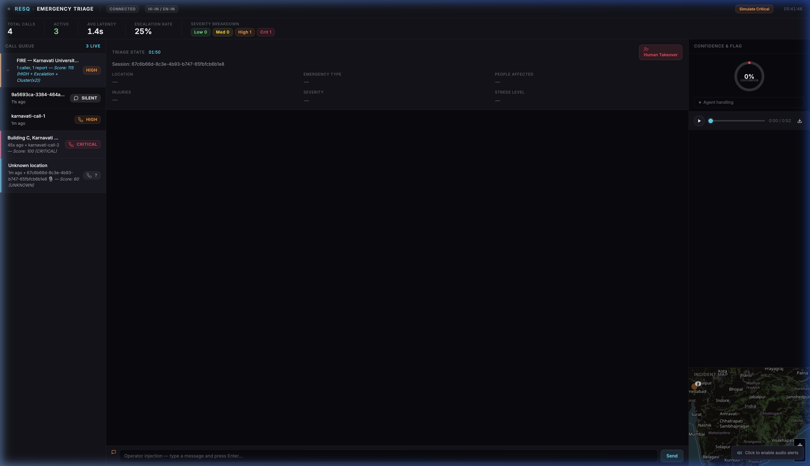
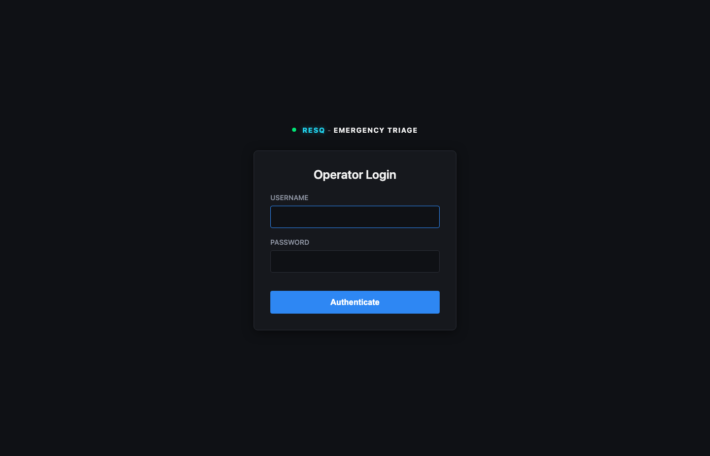
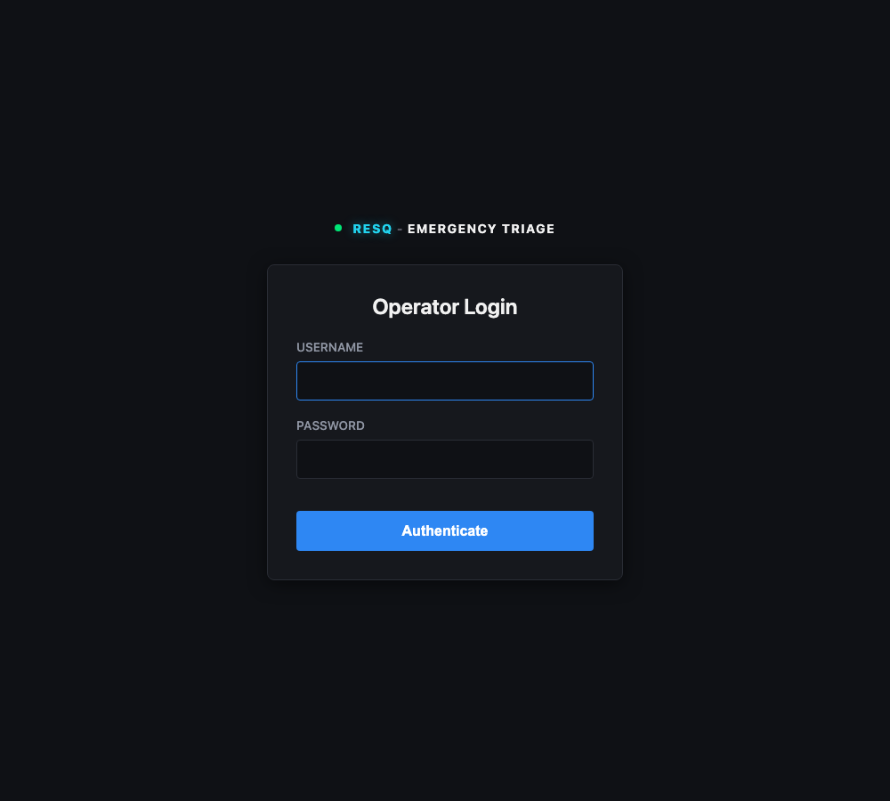
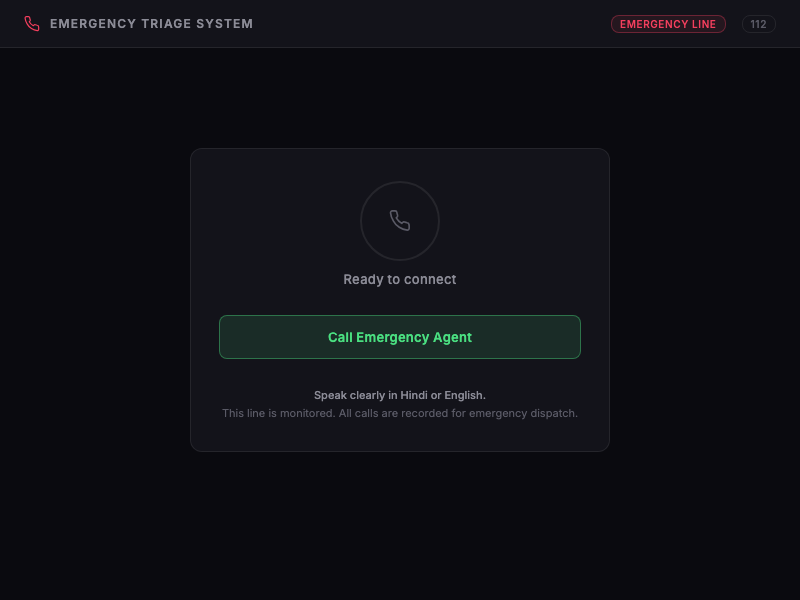

# RESQ: Autonomous Emergency Call Triage and Incident Clustering System

Autonomous Emergency Response, Real-Time Voice Triage, and Spatial Incident Clustering System for ERSS-112.

---

## Table of Contents

1. [Executive Summary](#executive-summary)
2. [Problem Statement](#problem-statement)
3. [System Architecture](#system-architecture)
4. [Core Features and Solutions](#core-features-and-solutions)
5. [Interface and Control Dashboard](#interface-and-control-dashboard)
6. [Engineering Implementation](#engineering-implementation)
7. [Technical Challenges and Overcomes](#technical-challenges-and-overcomes)
8. [Setup and Execution Guide](#setup-and-execution-guide)
9. [Configuration and Environment](#configuration-and-environment)
10. [Future Scope and Roadmap](#future-scope-and-roadmap)

---

## Executive Summary

RESQ is an enterprise-grade, omnichannel emergency response system engineered to modernize public safety helplines (such as India's Emergency Response Support System - ERSS 112). 

Traditional emergency hotlines experience critical bottlenecks during mass-casualty incidents, disasters, and peak hours due to finite human dispatch capacity, lengthy call-taking procedures, and language diversity. RESQ solves this through an autonomous, multilingual voice triage pipeline backed by real-time spatial-temporal clustering (DBSCAN), instant Computer-Aided Dispatch (CAD) metadata extraction, and human-in-the-loop operational oversight.

---

## Problem Statement

### Title: AI-Driven Automated Emergency Call Triage and Real-Time Incident Prioritization for ERSS-112

In emergency management, survival rates drop exponentially with every minute of delay. The current emergency hotline framework suffers from three foundational vulnerabilities:

1. **Call Queue Delays (The Chokepoint):** During catastrophic events (industrial fires, flash floods, highway pileups), call volumes surge by over 1,000%. Fixed-capacity human call centers force callers onto 3 to 7 minute hold queues. In critical trauma and asphyxiation events, irreversible injury occurs within 4 minutes.
2. **Delayed Dispatch Initiation:** Conventional dispatch protocols require human operators to interview the caller, take notes, and complete the call before filing a dispatch ticket. First responder mobilization lags 3 to 5 minutes behind call inception.
3. **Duplicate Report Fragmentation:** Large incidents generate dozens of simultaneous calls reporting the same occurrence. Without automated spatial correlation, dispatchers risk deploying multiple independent ambulances or fire units to one incident while leaving concurrent emergencies unserved.

---

## System Architecture

The RESQ architecture integrates WebRTC real-time media handling, streaming speech recognition, structured large language model reasoning, and an event-driven asynchronous backend.

```
                    CITIZEN INGESTION CHANNELS
  [ Voice Call: 2G/SIP/WebRTC ]          [ Silent Emergency Form / USSD ]
               |                                        |
               v                                        v
     [ LiveKit Media Server ]               [ FastAPI Ingestion API ]
               |                                        |
               v                                        |
     [ Voice Agent Worker ]                             |
       - 800ms WebRTC VAD                               |
       - Deepgram Nova-2 STT                            |
       - Google GenAI (Flash-Lite)                      |
       - Sarvam AI Streaming TTS                        |
               |                                        |
               +-------------------+--------------------+
                                   |
                                   v
                   [ Asynchronous Backend Engine ]
                     - Hierarchical Geocoding Cache
                     - DBSCAN Spatial-Temporal Clustering
                     - Dynamic Urgency Scoring (0 - 135)
                     - SQLite/PostgreSQL Session Store
                                   |
                                   v
             [ Dispatcher Control Dashboard (WebSocket) ]
               - Live Queue and Incident Aggregates
               - Leaflet Incident Map Visualization
               - Real-Time Turn-by-Turn Audio & Transcripts
               - One-Click Human Operator Interception
```

### Turn Pipeline Lifecycle

1. **Audio Ingestion & VAD:** Audio streams into the LiveKit worker. A local 800ms Voice Activity Detector (WebRTC VAD) segments caller utterances with sub-second silence gating.
2. **Speech-to-Text (STT):** Deepgram Nova-2 processes Hindi and Indian-accented English streams, emitting final transcript events over persistent WebSockets.
3. **Clinical & Situational Extraction (LLM):** Transcripts are ingested by an optimized multi-model cascade (primary: `gemini-3.5-flash-lite`), enforcing strict JSON schema constraints. The model extracts emergency category, address, casualty count, injury existence, caller stress, and priority triage level.
4. **Speech Synthesis (TTS):** Responses are streamed through Sarvam AI (`bulbul:v3`) directly to the caller as 20ms linear PCM frames, yielding total verbal turnarounds within 2.0 - 2.5 seconds.
5. **Spatial Correlation & Broadcast:** Coordinates are resolved via hierarchical geocoding and mapped to existing disaster clusters via DBSCAN. State changes broadcast to all authenticated dispatchers over persistent WebSockets within 15 milliseconds.

---

## Core Features and Solutions

### 1. Zero-Queue Concurrent Intake
Handles thousands of concurrent voice sessions simultaneously without degraded response latency. Every caller receives immediate assistance on Ring 1 without being placed on hold.

### 2. Turn-One First Responder Mobilization
Unlike human-operated workflows that require call termination before ticket generation, RESQ extracts geographic coordinates, emergency classification, and urgency metrics on the very first verbal exchange (Turn 1: approximately 3 seconds into the call). Units can be scrambled while the AI continues gathering supplementary first-aid details.

### 3. Spatial-Temporal Clustering (DBSCAN)
Correlates incoming reports occurring within a 150-meter radius and 15-minute rolling window using density-based spatial clustering of applications with noise (DBSCAN with Haversine metric).
* Aggregates redundant calls into a single incident dossier.
* Accumulates victim counts dynamically across callers.
* Prevents multi-unit dispatch overlap to identical disaster sites.

### 4. Omnichannel Silent Reporting Channel
For hostage, armed intrusion, domestic violence, or low-bandwidth scenarios where voice communication is dangerous or impossible, citizens submit reports via a dedicated silent form (`/dashboard/silent.html`). 
* Ingests GPS/location, description, and callback numbers.
* Maps directly into the primary triage database and DBSCAN cluster engine.
* Transmits as high-priority dispatch items with silent situation flags.

### 5. Multi-Model Cascade & Fault Tolerance
Guarantees high uptime through an autonomous retry and fallback mechanism across model candidates:
```
Primary: gemini-3.5-flash-lite (1.1s - 1.3s latency)
  --> Fallback 1: gemini-flash-lite-latest
    --> Fallback 2: gemini-3.8-flash
```
If an upstream API returns rate limits (HTTP 429) or transient server errors (HTTP 500/503), the agent gracefully cascades within a 4.5-second per-attempt threshold without terminating the caller session.

### 6. Human Operator Takeover
The control dashboard provides continuous supervisory control. Operators can inject live synthesized messages or fully seize the audio track with a single click, instantly disconnecting the autonomous AI pipeline.

---

## Interface and Control Dashboard

### 1. Incident Control Dashboard
The main dispatcher interface presents active calls, incident queues, real-time urgency metrics, GIS mapping, and individual caller triage cards.



* **Metrics Strip:** Live tracking of total call volume, active concurrent streams, average system latency (1.4s), escalation rate, and severity distribution.
* **Geospatial Incident Map:** Leaflet-powered dark mode map showing single calls (standard markers) and clustered multi-call disasters (pulsing red hazard clusters with member counts).
* **Live Triage Panel:** Instant visibility into detected emergency category, verified location coordinates, victim count, caller stress index, and internal AI reasoning explanations.
* **Live Telephony & Audio Player:** Operators can inspect turn-by-turn bilingual transcripts and stream full PCM session recordings directly from the browser.

---

### 2. Operator Authentication & Access Control
Access to the dispatch control room is secured via PBKDF2 password hashing with cryptographically random salts and 12-hour signed session cookies.



---

### 3. Silent Emergency Report Interface
Provides a minimal, fast-loading interface optimized for stealth reporting in domestic threat or silence-required emergencies.



---

### 4. Emergency Caller Client
WebRTC caller evaluation portal used to simulate end-user telephony interaction across audio devices.



---

## Engineering Implementation

### Technology Stack

| Layer | Technology | Purpose |
| :--- | :--- | :--- |
| **Backend Framework** | FastAPI (Python 3.11) | High-performance asynchronous API & WebSocket hub |
| **Database & ORM** | SQLAlchemy 2.0 (aiosqlite) | Fully asynchronous persistence for calls and clusters |
| **Real-Time Media** | LiveKit RTC & Agents SDK | Low-latency WebRTC audio transport and room management |
| **Voice Activity Detection** | WebRTC VAD (`webrtcvad`) | Local frame-by-frame speech silence boundary detection |
| **Speech-to-Text (STT)** | Deepgram Nova-2 (`hi`, `en-IN`) | Multilingual real-time streaming transcription |
| **Natural Language Triage** | Google Gemini 3.5 Flash-Lite | Structured Pydantic extraction and clinical reasoning |
| **Text-to-Speech (TTS)** | Sarvam AI (`bulbul:v3`) | Natural Indian-accented Hindi/Hinglish speech synthesis |
| **Spatial Clustering** | Scikit-Learn (DBSCAN) | Density-based geospatial clustering using Haversine distance |
| **Geocoding** | OpenStreetMap Nominatim | Hierarchical coordinate resolution with fallback parsing |
| **Frontend Dashboard** | Vanilla JS, HTML5, Leaflet.js | Zero-dependency high-speed operational monitoring UI |

### Database Architecture (`triage.db`)

* **`call_logs`**: Stores `session_id`, `incident_id`, `channel` (voice / silent_form), `language_detected`, `full_transcript` (turn-by-turn speaker objects), `triage_history` (array of extraction state snapshots), `is_complete`, `recording_path`, and timestamps.
* **`incidents`**: Stores spatial clusters with `incident_id`, `centroid_lat`, `centroid_lng`, `severity`, `members` (list of correlated session IDs), and update timestamps.
* **`operators`**: Stores operator authentication credentials with PBKDF2-SHA256 salt hashes.

---

## Technical Challenges and Overcomes

### 1. Turnaround Latency and Pipeline Serialization
* **Challenge:** Sequential execution of VAD, network STT, LLM inference, and TTS audio transfer routinely accumulated 8 to 12 seconds in early versions, rendering voice interactions unnatural.
* **Resolution:** 
  1. Tuned WebRTC VAD silence duration to 800ms, striking the optimum balance between cutting off hesitant callers and prompt conversational handoff.
  2. Migrated LLM inference to `gemini-3.5-flash-lite`, cutting reasoning generation time from 4.8s to 1.28s.
  3. Implemented streaming 20ms PCM audio frame synthesis via Sarvam AI HTTP chunking, starting playback while the remainder of the sentence is still downloading.

### 2. Audio Echo Loops and Self-Interruption
* **Challenge:** The microphone picked up agent output audio from the caller's speaker, causing the STT pipeline to transcribe its own questions and triggering infinite loops.
* **Resolution:** Introduced an asynchronous hardware playback gate with a 300-millisecond post-playback echo suppression grace window. All incoming user audio frames are discarded while agent speech is active.

### 3. Non-Indexed Building and Room Descriptions
* **Challenge:** Callers regularly provide sub-location details (*e.g., "Building C, Karnavati University, Gandhinagar"*). OpenStreetMap often failed exact matches on building names, returning 404 errors.
* **Resolution:** Developed a progressive fallback geocoding engine in `app/api/routes/geocode.py`. If exact match fails, it hierarchically strips the leftmost descriptors to resolve the campus, street, or municipal level successfully without failing triage.

### 4. Zero-Broadband Disaster Resilience
* **Challenge:** Evaluators questioned system vulnerability during total telecom and internet infrastructure collapse.
* **Resolution:** Structured a 4-tier disaster resilience protocol:
  1. Production SIP Trunking terminating on standard 2G Circuit-Switched GSM lines (no smartphone internet required).
  2. Fallback SMS and USSD (`*112#`) payload ingestion over low-power cellular signaling channels (-110 dBm).
  3. Tactical Edge Deployment on disaster response vehicles (Cells on Wheels) using local quantized models (Whisper-small + Gemma-2B) connected via ISRO GSAT / VSAT terminals.

---

## Setup and Execution Guide

### Prerequisites

* Python 3.11+
* Git
* LiveKit Cloud Account or Local LiveKit Server instance
* Google Gemini API Key
* Deepgram API Key
* Sarvam AI API Key

### Installation

1. **Clone the repository:**
   ```bash
   git clone https://github.com/Rehankhan575/RESQ-Emergency-Triage.git
   cd RESQ-Emergency-Triage/sih_triage
   ```

2. **Create and activate virtual environment:**
   ```bash
   python3 -m venv .venv
   source .venv/bin/activate
   ```

3. **Install dependencies:**
   ```bash
   pip install -r requirements.txt
   ```

4. **Configure Environment Variables:**
   Create a `.env` file in the `sih_triage` root directory (refer to Configuration section below).

5. **Start the FastAPI Backend Service:**
   ```bash
   uvicorn app.main:app --reload --port 8000
   ```

6. **Start the Autonomous Voice Worker Service (in a separate terminal):**
   ```bash
   source .venv/bin/activate
   USE_STREAMING_TTS=true ./run_worker.sh
   ```

7. **Access Services:**
   * **Control Dashboard:** `http://localhost:8000/dashboard/`
   * **Operator Login:** `http://localhost:8000/login` (Default: `admin` / `password`)
   * **Silent Emergency Reporting:** `http://localhost:8000/dashboard/silent.html`
   * **Hotline Caller Client:** `http://localhost:8080/`
   * **Interactive API Documentation:** `http://localhost:8000/docs`

---

## Configuration and Environment

Create a `.env` file in the `sih_triage/` directory with the following keys:

```ini
# Application Secrets
SECRET_KEY=production_secret_key_change_in_deployment
DASHBOARD_PASSWORD=password

# LiveKit Telephony / WebRTC Credentials
LIVEKIT_URL=wss://your-livekit-instance.livekit.cloud
LIVEKIT_API_KEY=your_livekit_api_key
LIVEKIT_API_SECRET=your_livekit_api_secret

# AI Model Keys
GEMINI_API_KEY=your_google_gemini_api_key
DEEPGRAM_API_KEY=your_deepgram_api_key
SARVAM_API_KEY=your_sarvam_ai_api_key

# Pipeline Tuning Parameters
VAD_SILENCE_MS=800
USE_VAD_TURN_DETECTION=true
USE_STREAMING_TTS=true
ENABLE_FILLERS=false
```

---

## Future Scope and Roadmap

1. **Direct C-DAC ERSS-112 Integration:** Transition from WebRTC prototype ingress to enterprise SIP/PRI trunking via government telecom gateways.
2. **On-Premise Edge Quantization:** Package the triage pipeline into containerized Docker images optimized for NVIDIA Jetson edge devices running quantized local LLMs for complete air-gapped field operations.
3. **Computer Vision Ingestion:** Extend the omnichannel pipeline to ingest citizen photo uploads, CCTV streams, and municipal traffic cameras for automated fire and structural damage verification.
4. **Fleet Telematics API Hook:** Integrate CAD output directly with state emergency vehicle tracking systems (e.g., 108 Ambulance GPS APIs) for automated route assignment.
